# PyXon

---

## 1. Project Overview

- **Project Name:** PyXon

- **Brief Description:**

  PyXon is a 2D territory-capture arcade game built with Python and Pygame, inspired by the classic *Xonix / Qix* genre. The player controls a ship moving across a bordered grid, drawing trails through empty space to claim territory. Reconnecting to a wall flood-fills the enclosed area and scores it. The goal is to capture **80% of the grid** to clear the sector and advance.

  Nine ghost types patrol the uncaptured space — each with its own movement pattern and rules. Some bounce at high speed, some follow wall edges, some freeze or curse the player on contact, and some hide inside already-captured territory waiting to ambush. If a ghost touches an active trail, it triggers an *infection* that crawls toward the player along the trail cells. Six power-up items drop onto the grid to provide temporary advantages. The game runs across 20 hand-crafted sectors with escalating ghost combinations. A built-in statistics system records every trail attempt and death to a CSV file, viewable as five interactive charts from the main menu.

- **Problem Statement:**

  Standard territory-capture games have one enemy type — the challenge is purely reflexes. PyXon gives each ghost a distinct behavior that the player has to read and respond to, turning each sector into a strategic puzzle rather than a pure speed test. The statistics system lets players review their own risk-taking behavior and see whether aggressive or cautious play actually produces better results.

- **Target Users:**

  Players who enjoy short arcade sessions with escalating difficulty, fans of classic grid games like Xonix or Qix, and anyone who likes roguelike-style challenge curves without long time commitments.

- **Key Features:**
  - 9 ghost types with distinct AI behaviors
  - 6 power-up items — Lightning, Snow, Sword, Slime, Heart, Star
  - 20 hand-crafted sectors with increasing ghost combinations
  - Trail infection mechanic — ghosts corrupt the active trail toward the player
  - Freeze and curse status effects
  - Statistics logger with 5 interactive chart tabs
  - Sound system with music, SFX, and mute toggle

- **Screenshots:**

  ### Gameplay

  #### Main Menu
  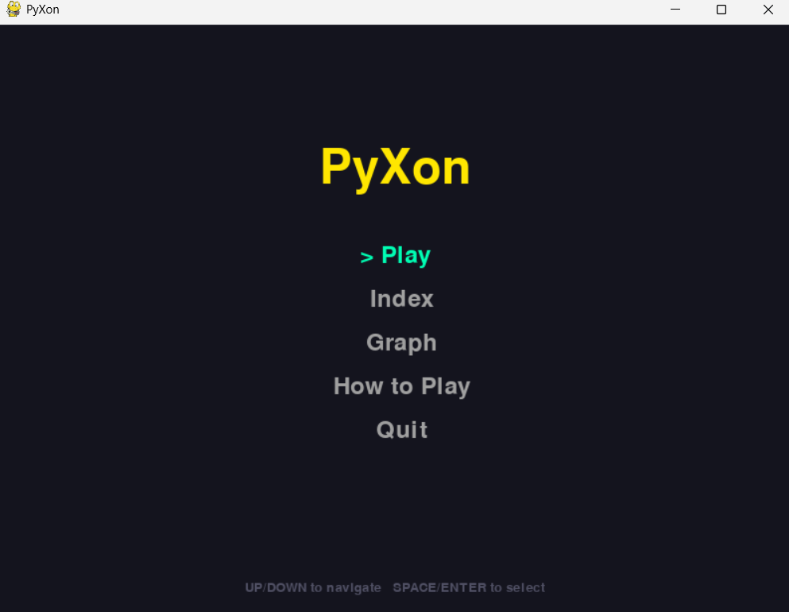

  #### Index / Navigation Screen
  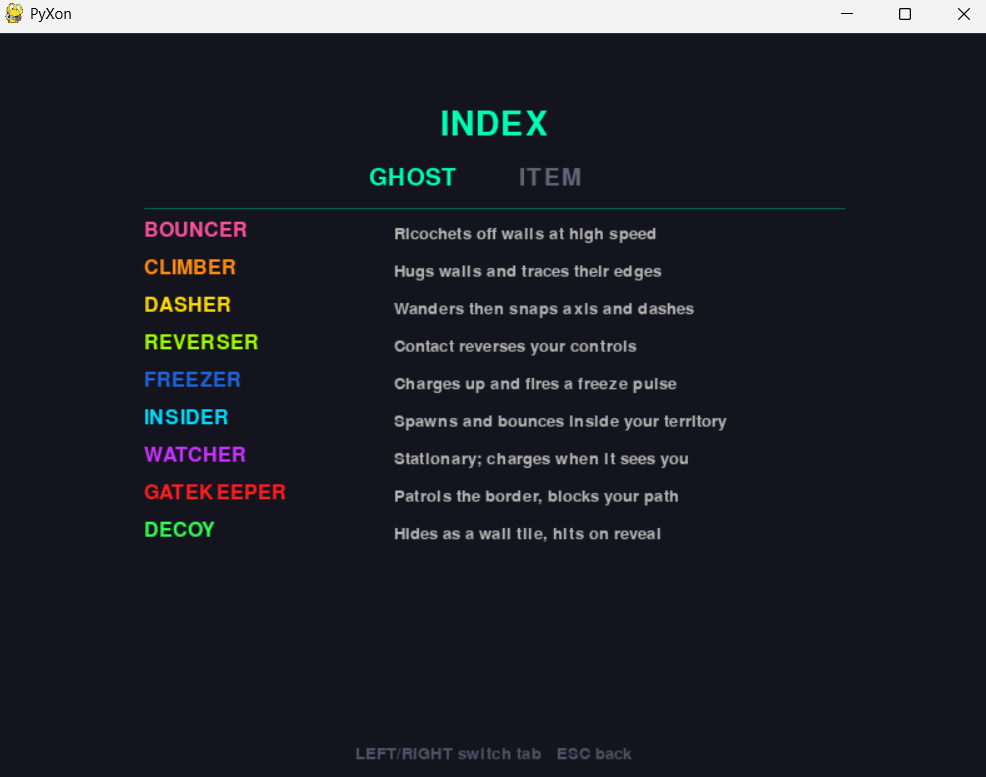

  #### Level Index
  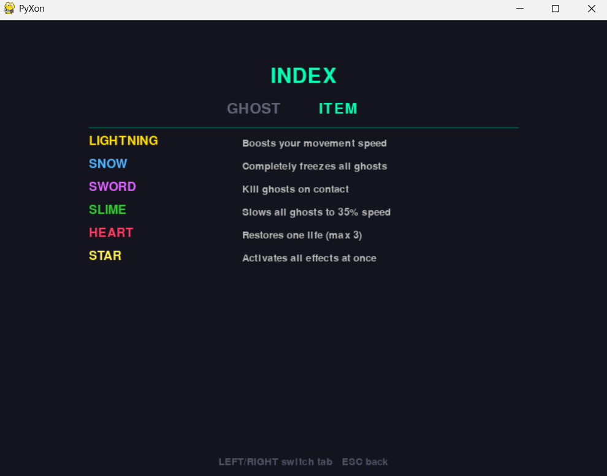

  #### How to Play
  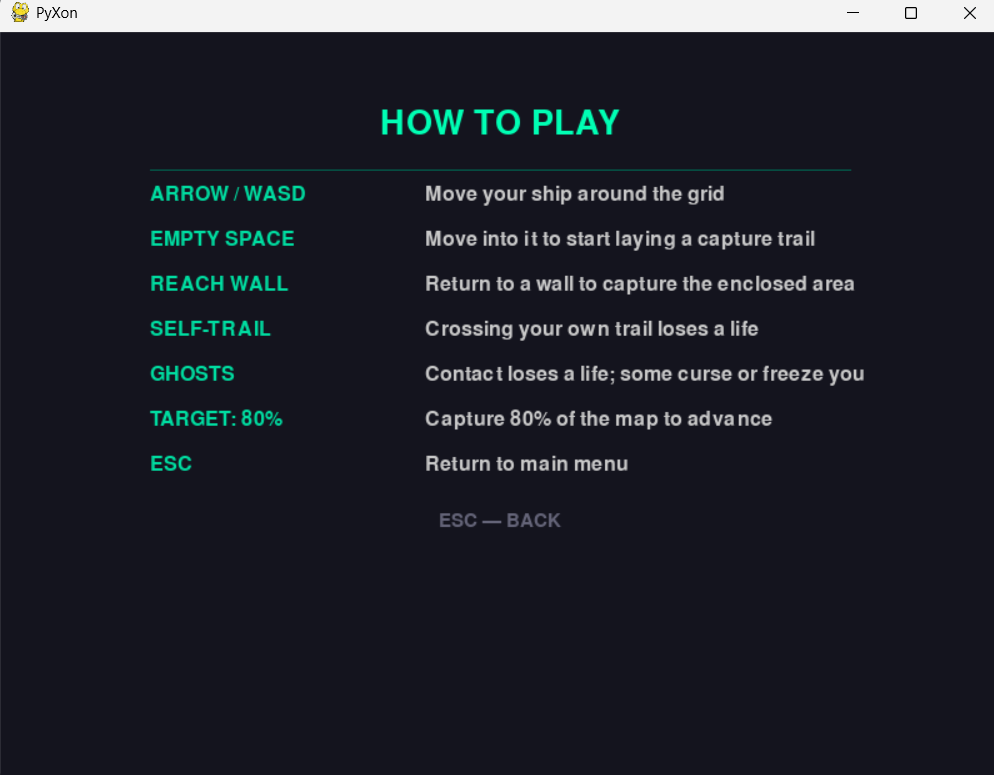

  #### Sector Start
  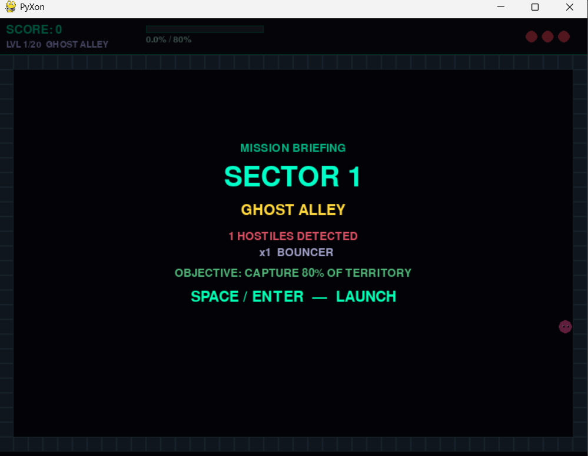

  #### In-Game (Territory Capture)
  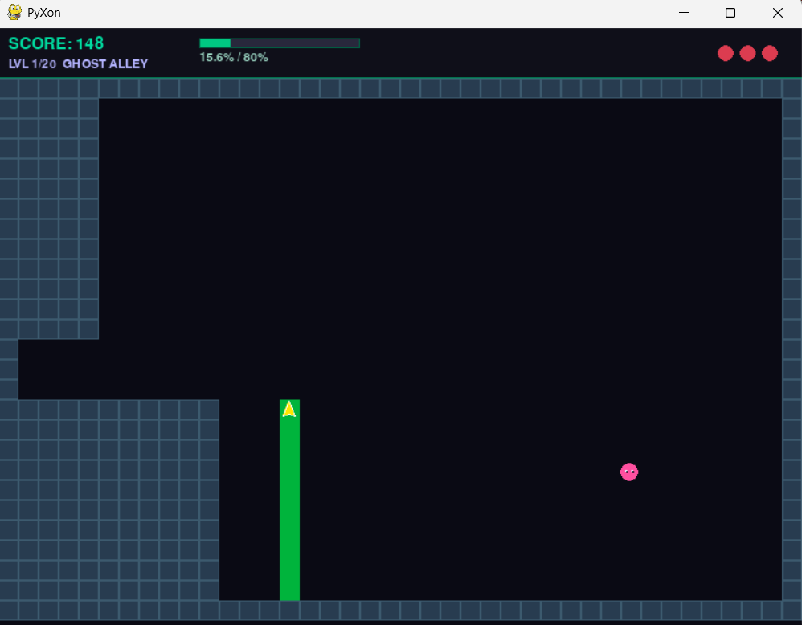

  #### Active Gameplay (Balls in Motion)
  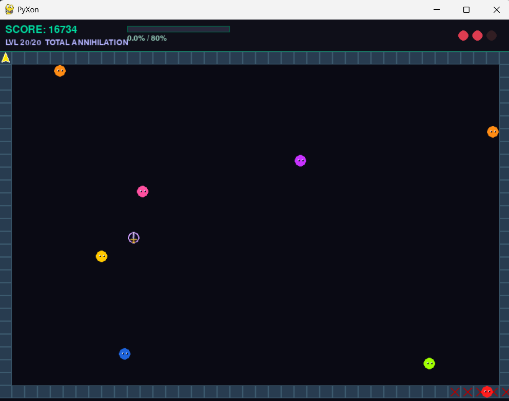

  #### Game Over Screen
  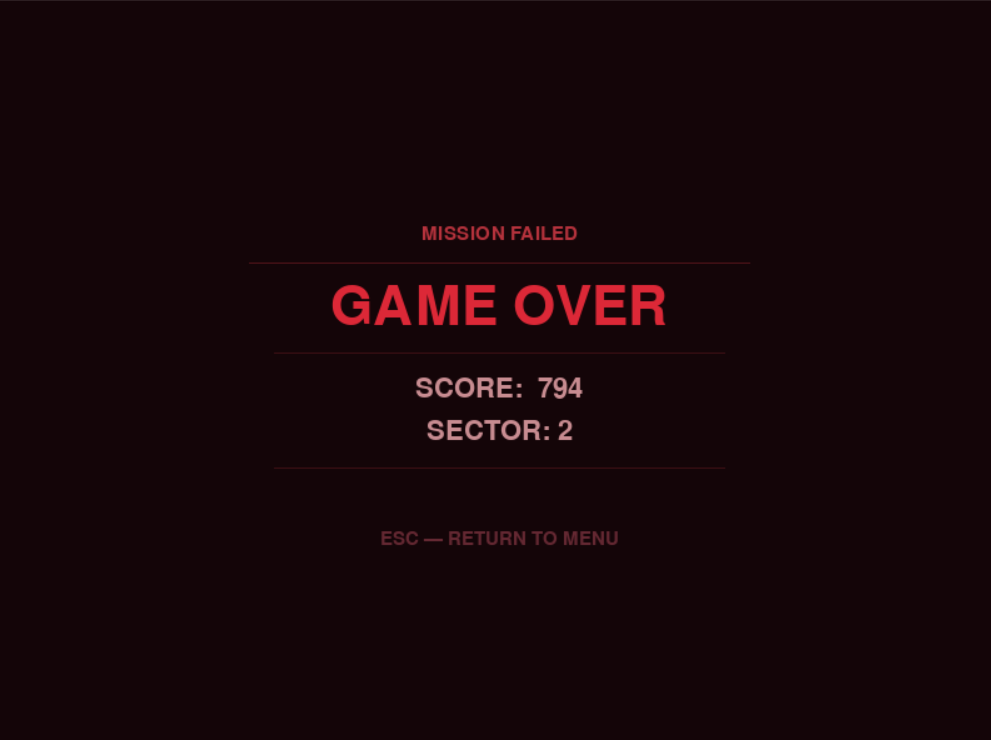

  ### Data Visualization

  #### Overall Summary Dashboard
  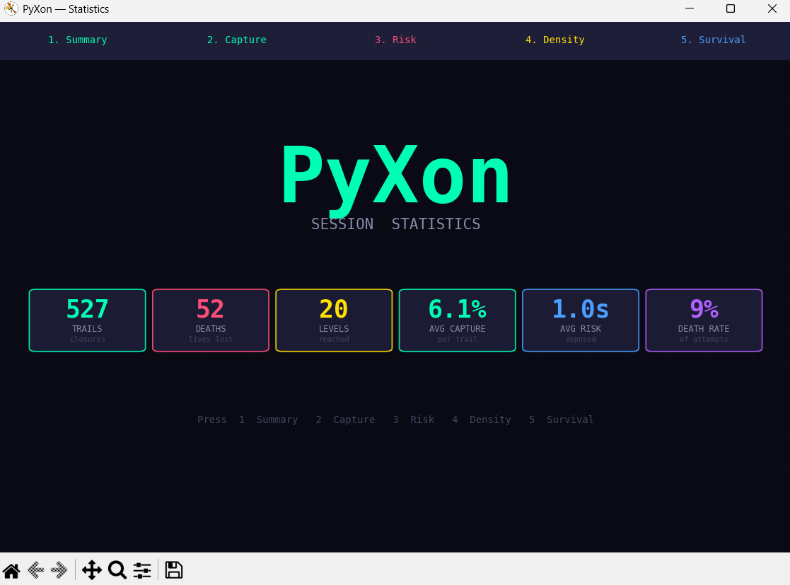

  #### Capture Efficiency (Bar Chart)
  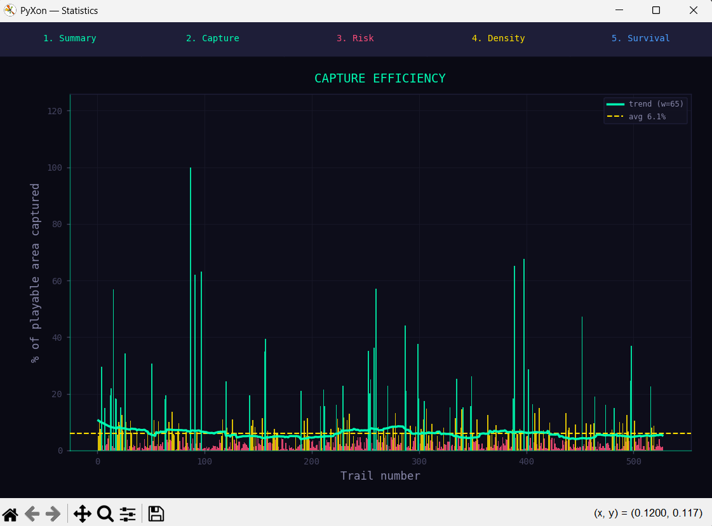

  #### Territory Density (Donut Chart)
  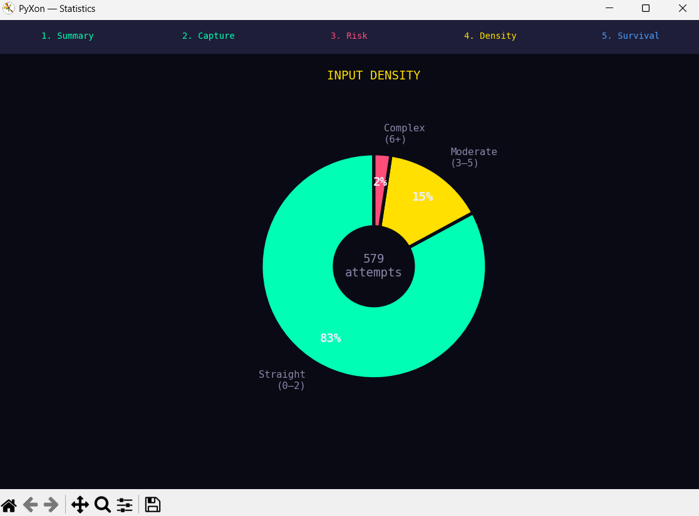

  #### Risk Duration (Line Chart)
  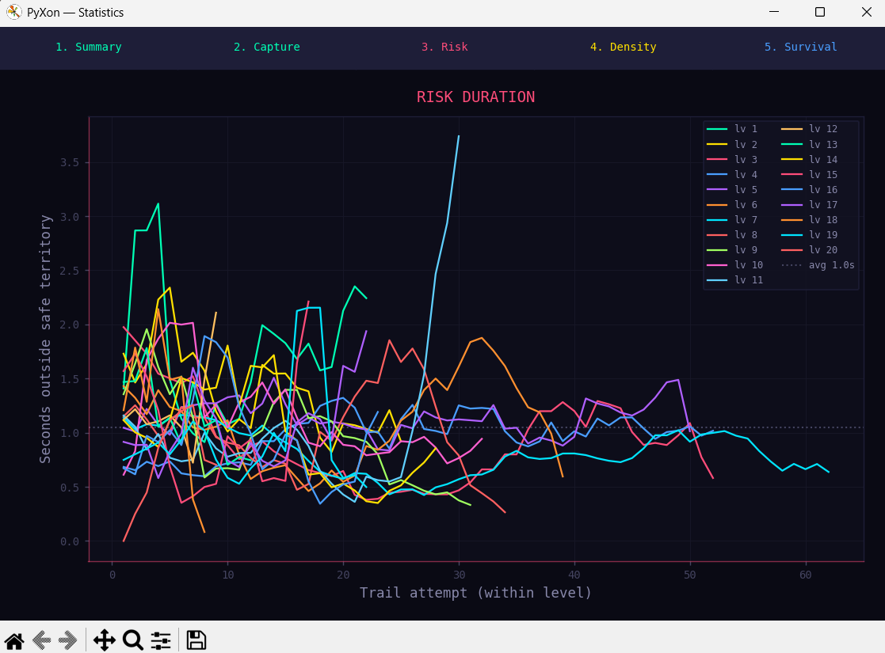

  #### Survival Time (Histogram)
  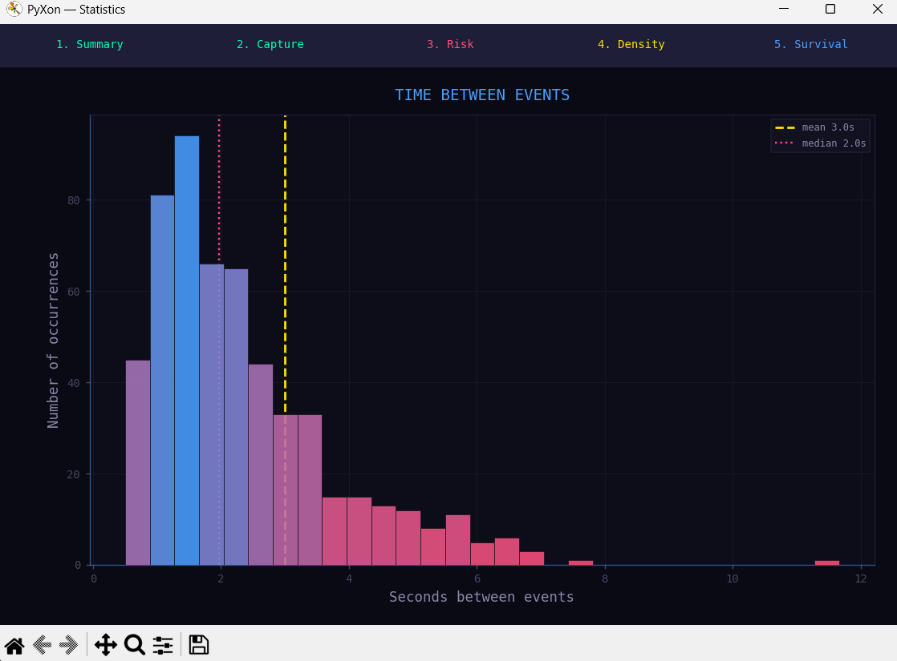

- **Proposal:** [proposal.pdf](descript/proposal.pdf)

- **YouTube Presentation:** *[Link to be added]*

---

## 2. Concept

### 2.1 Background

PyXon was built to modernize a classic arcade formula. The original Xonix genre has one enemy type, which means the challenge never evolves — only the speed does. By giving each ghost its own ruleset, the player has to think differently in every sector. The trail infection mechanic came from the same instinct: instant death when a ghost touches the trail felt unfair, so instead it gives the player a brief window to escape.

The territory system also maps naturally onto interesting data — every trail is a measurable risk decision, which makes the statistics genuinely worth reviewing.

### 2.2 Objectives

- Build a complete arcade loop with a clear win and lose condition per sector
- Make each of the nine ghost types feel meaningfully different
- Create a trail infection system that is tense but fair
- Structure 20 sectors so difficulty increases in a readable way
- Record gameplay data that reflects how the player takes risks and visualize it clearly

---

## 3. UML Class Diagram

[View UML Class Diagram (PDF)](descript/uml.pdf)

---

## 4. Object-Oriented Programming Implementation

### Base Classes

**`GameObject`** *(core/game_object.py)*
Root abstract class inherited by every entity. Holds `x`, `y`, `color`, `speed`, and declares `update()` and `draw()` as abstract methods.

**`Collision`** *(core/collision.py)*
Abstract interface with one method: `is_collision(x, y)`. Both `Player` and `Ghost` implement their own bounding-box logic.

### Class: `Player`

*(components/player.py)* — Inherits from `GameObject` and `Collision`.

- **Movement** — Grid-aligned movement with lerp smoothing and a configurable move delay
- **Trail System** — Tracks whether the player is trailing, blocks reversing direction mid-trail
- **Status Effects** — Handles freeze (player cannot move, trail is cleared) and curse (controls inverted)
- **Invincibility Frames** — Grants brief immunity after taking damage or starting a level
- **Stats Hooks** — Fires `on_trail_start`, `on_direction_change`, and `on_trail_close` into `StatsLogger`

### Class: `Ghost`

*(components/ghosts.py)* — Base class for all nine enemies. Provides shared wall-collision helpers (`_hits_wall`, `_bounce_move`, `_rescue_from_wall`) and a default `draw()`. Each subclass overrides only `update()`.

| Subclass | Behavior |
|---|---|
| `GhostBouncer` | Bounces off walls at high speed with independent axis reflection |
| `GhostClimberCW / CCW` | Follows wall edges clockwise or counter-clockwise |
| `GhostDasher` | Wanders slowly, then locks a direction and dashes |
| `GhostReverser` | Curses the player on contact, inverting controls for 4 s |
| `GhostFreezer` | Freezes the player on direct contact; infects the trail from a distance |
| `GhostInsider` | Spawns inside captured territory once 15% of the grid is filled |
| `GhostWatcher` | Stationary until the player enters its line of sight, then charges |
| `GhostGatekeeper` | Patrols the border and blocks re-entry while a trail is active |
| `GhostDecoy` | Disguises itself as a wall tile; lunges when the player steps adjacent |

### Class: `GameEngine`

*(core/game_engine.py)* — Main controller and game loop.

- **State Machine** — Five states: `MENU → READY → PLAY → GAME_OVER / COMPLETE`
- **Collision Resolution** — Handles all player–ghost interactions including special effects per ghost type
- **Infection System** — Ticks the trail infection each frame, triggers death when it reaches the player
- **Level Transitions** — Resets the grid, spawns new ghosts, and moves to the READY briefing screen
- **Screen Effects** — Manages flash overlays and status effect tints

### Class: `GridManager`

*(core/grid_manager.py)* — Owns and updates the game grid.

- **Grid State** — 2D array where `0` = empty, `1` = captured/wall, `2` = active trail
- **Trail Tracking** — Detects self-intersection and starts capture when the player returns to a wall
- **Flood Fill** — BFS-based fill that protects cells reachable by ghosts from being captured
- **Coverage** — Calculates the current capture percentage each frame

### Class: `ItemManager`

*(core/item_manager.py)* — Manages power-up spawning and effects.

- **Spawning** — Randomly places one item at a time on empty grid cells with a configurable interval
- **Effect Timers** — Tracks six independent timers (Lightning, Snow, Sword, Slime, Heart, Star)
- **Star Item** — Activates all five other effects simultaneously with a combined timer

### Class: `SoundManager`

*(core/sound_manager.py)* — Handles all audio.

- **Pre-loading** — All WAV files loaded at startup into a keyed dictionary
- **Channels** — Dedicated mixer channels for trail sounds, infection ticks, and music
- **Theme Switching** — Smooth transitions between menu and in-game themes without restarts
- **Item Sounds** — Individual collect sounds per item type

### Class: `StatsLogger`

*(core/stats_logger.py)* — Records gameplay events to CSV.

- **Event Hooks** — Called by `Player` on trail start and direction change, by `GridManager` on trail close, and by `GameEngine` on player death
- **Append Mode** — Rows are appended so data accumulates across sessions without overwriting
- **Timestamps** — Each row includes a Unix timestamp to separate sessions after the fact

### Class: `graph_viewer`

*(core/graph_viewer.py)* — Standalone statistics window.

- **Subprocess Launch** — Opened from the main menu as a separate process so it doesn't block the game
- **Five Tabs** — Summary cards, Capture Efficiency bar chart, Risk Duration line chart, Input Density donut, Survival Time histogram
- **Auto-detect Header** — Reads `stats.csv` correctly whether or not a header row is present

### Class: `Menu`

*(core/menu.py)* — Main menu and sub-screens.

- **Views** — Main options, How to Play, Ghost/Item Index, Graph launcher
- **Font Cache** — Class-level cache avoids recreating font objects every frame

---

## 5. Statistical Data

### 5.1 Data Recording Method

Data is written to `stats.csv` in the project root in append mode. No new file is created per session — all runs accumulate in one file. Each row has a Unix timestamp so sessions can be filtered or separated if needed.

Every trail closure and player death is logged as one row. A typical session of 30–40 trails produces roughly **30–50 rows**. This raw data drives all five visualization tabs.

### Raw Data Example

| event | level | capture_efficiency | risk_duration | ghost_proximity | input_density | survival_time | timestamp |
|---|---|---|---|---|---|---|---|
| trail_close | 1 | 4.42 | 2.38 | 24.28 | 7 | 2.71 | 1777353498.99 |
| trail_close | 1 | 0.95 | 0.42 | 10.38 | 1 | 0.58 | 1777353501.70 |
| player_death | 2 | 0.00 | 1.10 | 3.20 | 2 | 1.45 | 1777353512.00 |

### 5.2 Data Features

| Feature | Objective | Source | Display |
|---|---|---|---|
| Capture Efficiency | How much territory each trail claims | `GridManager.flood_fill` | Bar chart with trend line |
| Risk Duration | How long the player stays exposed | `StatsLogger.on_trail_start/close` | Line chart per level |
| Ghost Proximity | How close danger was when the trail ended | `StatsLogger._nearest_ghost_distance` | Included in risk/summary |
| Input Density | How complex the player's path was | `StatsLogger.on_direction_change` | Donut chart (3 categories) |
| Survival Time | Time between events | Timestamp delta | Histogram |

---

## 6. Changed Proposed Features

- **Ghost types expanded significantly** — the proposal defined only two ghost types (`Ghost_Chaser` and `Ghost_Bouncer`). The final game ships with nine distinct types: Bouncer, Climber CW/CCW, Dasher, Reverser, Freezer, Insider, Watcher, Gatekeeper, and Decoy. `Ghost_Chaser` was dropped entirely in favor of more interesting movement patterns.

- **Trail infection mechanic added** — the proposal specified instant death when a ghost touches the trail. The final game instead starts an infection that crawls toward the player along the trail cells, giving a brief window to escape before dying. This makes trail hits feel fairer and more engaging.

- **Status effects added** — freeze and curse were not in the proposal. Freeze stops the player from moving and clears the active trail; curse inverts the player's controls for 4 seconds. Both are triggered by specific ghost types.

- **Power-up item system added** — the proposal had no items. The final game includes six collectible power-ups (Lightning, Snow, Sword, Slime, Heart, Star) that spawn on the grid and provide timed advantages.

- **20 hand-crafted sectors added** — the proposal described a single level loop with no sector structure. The final game has 20 named sectors each with a specific ghost lineup, displayed on a briefing screen before the sector starts.

- **Statistics visualization changed** — the proposal planned to use Pandas and a separate analysis script. The final implementation uses only Matplotlib, launched as a subprocess directly from the main menu, with no Pandas dependency. The graph types also shifted: Capture Efficiency became a bar chart (was scatter plot), Input Density became a donut chart (was bar chart), and Ghost Proximity is shown in the Summary tab rather than as a standalone histogram.

- **`StatsLogger` simplified** — the proposal described `record_event()`, `write_csv()`, and `reset_session()` methods with a data buffer. The final implementation writes directly to the CSV in append mode with no buffer, using event hooks (`on_trail_start`, `on_direction_change`, `on_trail_close`, `on_player_death`) instead of a generic `record_event()` call.

---

## 7. External Sources

- **Sound effects and music** — Generated using Gemini AI
- **Item icons** (lightning, snow, sword, slime, heart, star) — Generated using Gemini AI